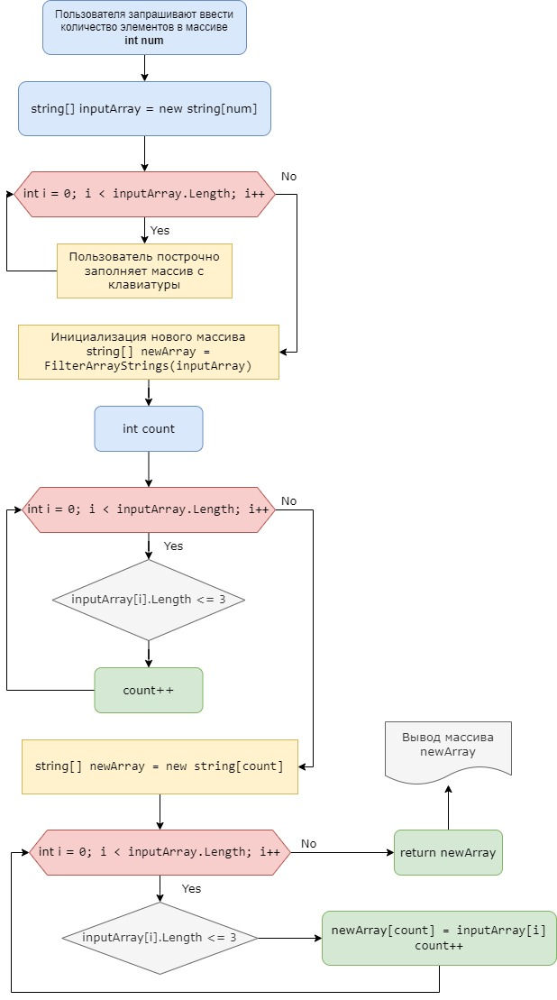

# Итоговая проверочная работа I четверти

__Задача:__ Написать программу, которая из имеющегося массива строк формирует массив из строк, длина которых меньше либо равна 3 символа. Первоначальный массив можно ввести с клавиатуры, либо задать на старте выполнения алгоритма. При решении не рекомендуется пользоваться коллекциями, лучше обойтись исключительно массивами.

__Примеры:__

["hello", "2", "world", ":-)"] -> ["2", ":-)"]

["1234", "1567", "-2", "computer science"] -> ["-2"]

["Russia", "Denmark", "Kazan"] -> []

# Решение задачи

_Алгоритм выполнения программы следующий:_

1. Выводится сообщение "Input number of elements in the array:", которое просит ввести количество элементов в массиве.

2. Пользователь вводит число num, которое является размером массива inputArray.

3. С помощью цикла for элементы массива inputArray заполняются строками, которые вводит пользователь.

4. Вызывается метод FilterArrayStrings, который принимает на вход массив inputArray.

5. Внутри метода FilterArrayStrings создается переменная count, которая используется для подсчета количества строк с длиной меньше или равной 3 символам.

6. Используется внутренний цикл for для прохода по всем элементам массива inputArray и определения тех элементов, у которых длина меньше или равна 3 символам.

7. Если длина строки меньше или равна 3 символам, то строка добавляется в массив newArray в ячейку с индексом count, а переменная count увеличивается на единицу.

8. После этого вызывается метод ShowArray, который принимает в качестве параметра массив array и выводит все его элементы через пробел.

9.  В конечном итоге на экран выводится текст "Strings with length less than or equal to 3:" и результат выполнения метода ShowArray для массива newArray.

